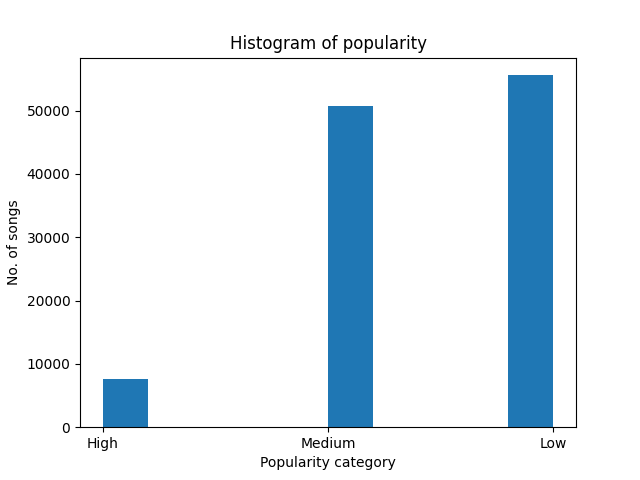
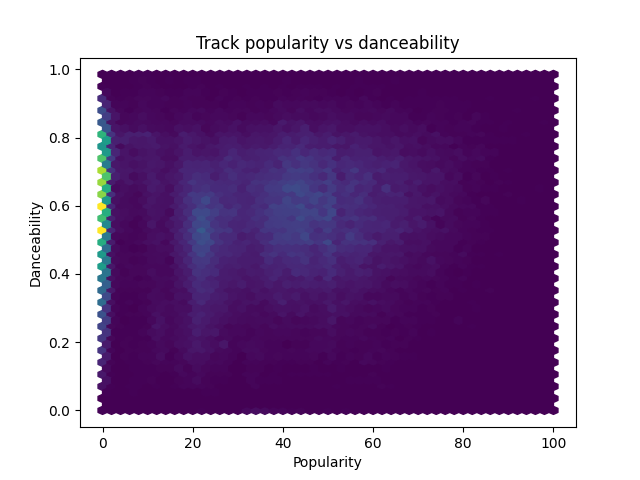
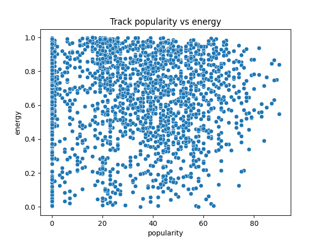
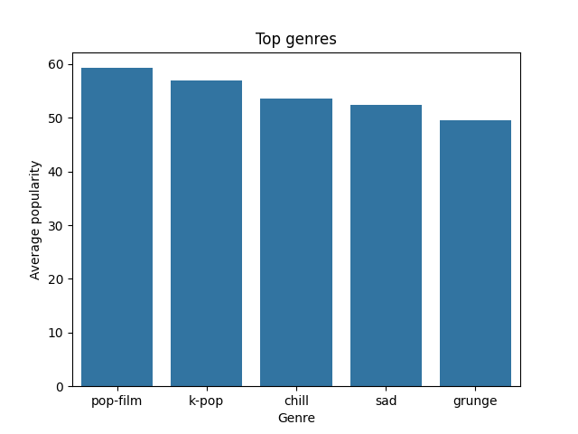

# Spotify Music Trends Analysis
Spotify Music Trends analysis. Taking a look at: song popularity, duration, danceability, energy and valence.

## Features
- Data analysis and exctraction
- Data visualization
- Report on the analysis performed

## Tech stack
- Python (Pandas)

## Dataset used
- Spotify Tracks Dataset from Kaggle


Great dataset with alot of data and most importantly, it is clean!

Link:  https://www.kaggle.com/datasets/maharshipandya/-spotify-tracks-dataset

License:  http://opendatacommons.org/licenses/odbl/1.0/
## Graphs

-History of popularity:



Track popularity vs danceability:



Track popularity vs energy:



Top genres:



All of the graphs here are included in the project files (output folder).

## Report
The feature that has the highest positive correlation with popularity is: Loudness (0.05) -> still pretty low

The Histogram of popularity shows us that as expected, high popularity songs tend to be rare.
The rate of highly popular songs is slightly over 6%.

We can also see that popular songs tend to be more danceable.

Most songs from the dataset are in the upper level of energy, but we can not see a clear correlation with popularity.The most popular songs are in all areas of energy.

Full report can be found in the project files (report.txt).

## How to install 
Requirements: see ```requirements.txt```

Run this command into a terminal of your choice to download:
```bash
git clone https://github.com/nokeeb/spotify-analysis
```
then:
```bash
pip install -r requirements.txt
python analysis.py
```


## Mission
Upgrading knowledge in Python, more precisely in:
- Pandas
- Matplotlib and Seaborn
